# IFQ636 A2 - Working Report Draft

Shared drafting surface for the team report. Headings below match the supplied
template (`documents/IFQ636 Assignment 2 template.docx`) exactly, so prose drops
straight into the template on build day.

**How to use this file**
- Draft prose under each heading. One person can own a section; note your initials
  in the heading while it is in progress (e.g. `## Project overview - RL drafting`).
- Raw material (facts, decisions, talking points, sources, GenAI uses) is captured
  live in [`planning/A2_Report_Notes.md`](planning/A2_Report_Notes.md). Pull from
  there; don't reconstruct at the end.
- Target ~3000 words (range 2700-3300). Per-section budgets are guides, not limits.
- Australian English. No AI-attribution anywhere. Cite in APA 7th. Page numbers on
  direct quotes and specific factual claims.
- The final report is built into the template via the python-docx pipeline, not by
  pasting from here into Word by hand.

> Status: section 3.1 underway (Builder and Factory Method written). All other sections still to draft.

---

## Project overview (~150-200 words)
*Real-world application, what it does, who it serves, why VacayPlan was chosen as the base to extend.*

VacayPlan is a full-stack vacation-planning web app for travellers organising multi-day trips. The backend is Node.js, Express and MongoDB; the frontend is React and TailwindCSS; CI/CD runs through GitHub Actions to an AWS EC2 instance. An authenticated user creates a trip with a destination and date range, schedules activities, reviews the day-by-day itinerary, and (as an extension) sees the destination forecast for the trip dates. A separate administrator role manages user accounts and views all trips. It serves two audiences: travellers planning holidays and an admin overseeing the platform.

We extended this base because its structure made that straightforward: trips, activities and user management are cleanly separated, so each part can be reasoned about and changed in isolation. That gave each domain a home for new design patterns, letting us strengthen the architecture and apply object-oriented principles without reworking the foundations.

---

## SRS documentation (~600-800 words total across 2.1-2.11)

### 2.1 Purpose (~40 words)
VacayPlan lets independent travellers plan a trip in one place: record it, schedule activities within its dates, check the forecast, and review it as a day-by-day itinerary. An administrator manages platform accounts.

### 2.2 Problem statement (~80 words)
Planning a multi-day trip scatters across tools never built for it - notes apps, spreadsheets, booking emails, group chats, a weather site. None treat a trip as an object: activities come loose of their days, the itinerary never exists as one view, and the forecast sits separately. Travellers hold the plan in their heads. VacayPlan gives trip planning a single, trip-shaped home.

### 2.3 Scope (~60 words)
In scope: traveller authentication (register, log in, log out, update profile); full trip CRUD; activities within a trip's date range; the day-by-day itinerary; a destination weather forecast; and an admin panel for account management and trip visibility.
Out of scope: bookings, payments, reservations; multi-user sharing or collaboration; native mobile apps; email or push notifications. VacayPlan is a planning record, not a booking engine.

### 2.4 User characteristics (~50 words)
VacayPlan has two actors (Figure 2). The Traveller is a non-technical end user planning personal holidays, expecting a fast, self-explanatory interface on desktop or mobile, and owns only their trips and activities. The Administrator is a trusted operator who manages accounts and views all trips for moderation.

### 2.5 Constraints (~50 words)
The build extends the existing base, so the stack is fixed: Node.js/Express, MongoDB Atlas, and React on a single AWS EC2 instance via GitHub Actions CI/CD. External services like Open-Meteo (no API key) must be free-tier. Academic requirements: at least seven backend design patterns, OOP principles, and unit and API testing. Three people, roughly four weeks. Open-Meteo forecasts up to 16 days ahead, so trips beyond that have no forecast.

### 2.6 Functional requirements (~30 words + table)
VacayPlan defines 23 functional requirements as "shall" statements per IEEE Std 830-1998 (Institute of Electrical and Electronics Engineers, 1998). Authentication (FR-01-FR-04): registration, JSON Web Token (JWT) login (Jones et al., 2015), protected-route access, and logout. Trip management (FR-05-FR-11): full CRUD plus the planning-active-completed lifecycle (FR-09/FR-10) and cascade deletion of activities (FR-11). Activity management (FR-12-FR-15): date-constrained activities by day. Administration (FR-16-FR-23): account management, cross-account trip visibility, deactivation enforcement, a consistent JSON shape, and request validation. Full table in Appendix C.

### 2.7 Non-functional requirements (~30 words + table)
Fourteen non-functional requirements define the quality attributes (Sommerville, 2016). Performance (NFR-01/02): sub-500ms CRUD responses and a two-second dashboard render. Reliability (NFR-03/04): 99% uptime via PM2 and automatic CI/CD redeploy on every push. Security (NFR-05-NFR-08, NFR-13): bcrypt password hashing (Provos & Mazières, 1999), JWT expiry, admin-only middleware, no secrets in version control, and a single shared database connection. Usability (NFR-09/10): a responsive UI and safe error messaging. Scalability (NFR-11/12): stateless horizontal scaling and schema-free collection growth. Availability (NFR-14): core planning stays usable when external services fail. Full table in Appendix C.

### 2.8 User interface mockups/wireframes (~20 words + figure)
Low-fidelity wireframes for Dashboard, Trip Detail, and Edit Trip at desktop and mobile breakpoints; red boxes mark pattern-backed additions.

### 2.9 Complete system diagram (~20 words + figure)
Figure 1 shows the architecture: the React SPA reaches the Express backend on AWS EC2 over HTTP via an Nginx reverse proxy, which connects to MongoDB Atlas and the Open-Meteo weather API, deployed via GitHub Actions CI/CD.

### 2.10 Safety considerations (~100 words)
VacayPlan's safety has three layers. At the network layer, Nginx serves the app and reverse-proxies API calls to the Express backend, which reaches MongoDB Atlas over TLS; the public endpoint is HTTP (the unit's bare-IP model), with client-facing TLS a future step. At the application layer, every authenticated route passes through the middleware chain (`protect`, `adminProtect`, `validate`) before business logic runs, and `withOwnership` checks ownership to block cross-user access. At the data layer, the Facade cascades deletions across related models to avoid orphaned records, and the weather adapter enforces an 8-second timeout on hung requests.

### 2.11 Risk management (~60 words + table)
Risk management uses the STRIDE threat model (Shostack, 2014); each category maps to a VacayPlan-specific risk and its control, or a gap where none exists.

| Threat                  | VacayPlan risk                                            | Mitigation                                                       | Status    |
|:------------------------|:----------------------------------------------------------|:-----------------------------------------------------------------|:---------:|
| Spoofing                | Forged identity or stolen JWT accesses protected routes   | bcrypt hashing; JWT 30-day expiry; `protect` on every request    | Mitigated |
| Tampering               | User modifies another user's trip or activity             | `withOwnership` checks ownership before write handlers run       | Mitigated |
| Repudiation             | User denies a trip or activity change                     | No audit log implemented                                         | Gap       |
| Information disclosure  | Trip data exposed to wrong user; credentials leaked       | Ownership checks on all routes; TLS on Atlas; `.env` gitignored  | Mitigated |
| Denial of service       | Unbounded requests exhaust server; weather API hangs      | 8-second timeout on weather adapter; no bulk endpoints           | Mitigated |
| Elevation of privilege  | Regular user accesses admin-only routes                   | `adminProtect` checks `isAdmin`; admin routes mounted separately | Mitigated |

---

## Implementation (coding) using design pattern and OOP principles (~650-800 words)
*This is the 28-pt criterion.*

### 3.1 Design pattern (~400-500 words)
*Minimum 7 patterns, each justified and demonstrated in backend code. Pattern-count ladder: 7=HD, 6=D, 5=C, 4=P. Live committed list lives in `planning/A2_Checklist.md` pattern tracker.*

Adapter, a structural pattern (Gamma et al., 1994), wraps the Open-Meteo weather service. `WeatherProvider` defines the forecast interface the app depends on; `OpenMeteoWeatherAdapter` translates the vendor's coordinate-based, WMO-coded responses into a normalised forecast object. A new provider means a new `WeatherProvider` subclass, leaving controllers, routes, and frontend untouched. Implementation: `backend/adapters/weatherAdapter.js`, serving `GET /api/trips/:id/weather` (commit `37b337c`).

Builder, a creational pattern, assembles trip queries and updates. `TripQueryBuilder` builds the user's trip-list filter with newest-first sort; `TripUpdateBuilder` builds partial updates without overwriting omitted fields. Both keep controllers on HTTP coordination, not construction. Implementation: `backend/builders/tripBuilders.js`, used by `tripController.js` in `getTrips` and `updateTrip` (commit `6965ef3`).

Factory Method, a creational pattern, centralises user-response construction. Previously `authController.js` and `adminController.js` built responses inline, giving inconsistent field names (`id` vs `_id`) across five handlers. `UserResponseFactory.create()` returns a guaranteed shape, removing that inconsistency and decoupling creators from their objects (Shvets, 2021c). Implementation: `backend/factories/userResponseFactory.js` (commit `e0b85f0`).

Facade, a structural pattern, hides multi-model cascade complexity behind a simple service interface. Previously `tripController.deleteTrip` and `adminController.deleteUser` coordinated Trip, Activity, and User models inline, coupling HTTP flow to data. `TripService.deleteTripWithActivities()` and `UserService.deleteUserWithCascade()` wrap those cascades in single calls, leaving each controller just request handling. Implementation: `backend/services/` (commit `30fe755`).

Singleton, a creational pattern, enforces a single Mongoose connection. The prior `connectDB()` relied on a single call site rather than a guarantee; `Database.getInstance()` makes it explicit: a second instance throws, and `connect()` reuses the stored connection. Implementation: `backend/config/db.js` (commit `ccd56e0`), six unit tests in `backend/test/dbSingleton.test.js`.

Chain of Responsibility, a behavioural pattern, sequences authentication, authorisation, and validation before business logic runs. `protect` and `adminProtect` formed a latent chain; a new `validate(rules)` link completes it, each link stopping on failure or calling `next()` (Shvets, 2021a). Implementation: `backend/middleware/validateMiddleware.js`, wired per route in `adminRoutes.js` (commit `c42bf6d`).

Decorator, a structural pattern, removes the ownership check duplicated across eight trip and activity handlers, each of which fetched the trip, returned 404 if absent, and re-checked ownership inline. `withOwnership(handler)` in `backend/middleware/ownershipDecorator.js` wraps those three steps and delegates only when the guard passes, adding behaviour without changing the wrapped function (Shvets, 2021b). Implementation: `tripRoutes.js` and `activityRoutes.js` (commit `e64ca7d`).

State, a behavioural pattern, enforces the trip lifecycle in FR-10 (planning -> active -> completed, completed terminal). `PlanningState`, `ActiveState`, and `CompletedState` each implement `canTransitionTo(newStatus)`, holding state-specific behaviour rather than if/else chains in the controller (Shvets, 2021d). `tripController.updateTrip` rejects invalid transitions with a 400 response (NFR-10). Implementation: `backend/state/tripState.js` (commit `23a0d48`), nine unit tests across `backend/test/trip.test.js` (six API-level transition tests) and `backend/test/tripState.test.js` (three covering the base-class guard, unknown status, and the full lifecycle matrix).

### 3.2 Implementation of OOP (~250-300 words)
*Classes, Objects, Inheritance, Encapsulation, Polymorphism with code examples and justification.*

**Classes and objects.** VacayPlan's backend is built around ES6 classes. `Database` in `backend/config/db.js` is one example: the class is the connection blueprint; `Database.getInstance()` returns the single object holding the live Mongoose connection. `TripService` and `UserService` in `backend/services/` follow the same shape: each is a class exported as a constructed object, bundling related operations (cascade deletion, ownership verification) around shared state rather than loose functions (Martin, 2017; Fig 3.2.1).

**Fig 3.2.1** - `Database` class with `getInstance()` (db.js)

**Encapsulation.** `OpenMeteoWeatherAdapter` in `backend/adapters/weatherAdapter.js` exposes one public method, `getForecast()`, and hides five internal methods (`_geocode()`, `_getJson()`, `_normaliseDaily()`, `_formatPlaceName()`, `_pickBestMatch()`). Geocoding, HTTP handling, and WMO-code translation stay hidden; controllers call `getForecast()` without knowing the vendor response shape, so a format change touches only the adapter (Fig 3.2.2).

**Fig 3.2.2** - `getForecast()` delegating to private helpers (weatherAdapter.js)

**Inheritance.** Two class hierarchies appear. `OpenMeteoWeatherAdapter extends WeatherProvider` in `backend/adapters/weatherAdapter.js`: `WeatherProvider` defines the `getForecast()` interface (throwing if not overridden); the subclass supplies the Open-Meteo implementation. `PlanningState`, `ActiveState`, and `CompletedState` all extend `TripState` in `backend/state/tripState.js`, each overriding `canTransitionTo(newStatus)` with its own rules. Both follow one approach: an abstract base class sets a contract and concrete subclasses implement it, programming to an interface, not a concrete class (Gamma et al., 1994; Fig 3.2.3).

**Fig 3.2.3** - `TripState` base class and subclasses (tripState.js)

**Polymorphism.** The State hierarchy shows runtime polymorphism. `isValidTransition()` in `tripState.js` calls `state.canTransitionTo(newStatus)` without knowing the concrete class: `PlanningState` returns true only for `'active'`, `CompletedState` always false. The signature is identical across the three subclasses, with the right implementation resolved at runtime (Fig 3.2.4).

**Fig 3.2.4** - `isValidTransition()` calling `canTransitionTo()` (tripState.js)

---

## Team collaboration via GitHub (~200-250 words)

### 4.1 Team collaboration statement
We organised work as GitHub issues, labelled by report section and assigned to one owner, tracked on a shared Project board (Todo, In progress, In review, Done). Each task ran on its own short-lived feature branch from main (Chacon & Straub, 2014), with several pull requests open at once so the queue stayed short and changes small and reviewable. At least one other member reviewed and approved every pull request before merge; we used ordinary merge commits, not squashing or rebasing, so per-author history and resolved merge conflicts stayed on record. All three committed under our own identity, coordinating through a Tuesday email check-in, a standing Saturday call, and a WhatsApp group.

### 4.2 Team collaboration evidence
*Feature branches; PRs; minimum 2 resolved merge conflicts; commit history graph; meeting times/dates. Meeting log + merge-conflict log are kept in `planning/A2_Report_Notes.md` §4.2.*

The commit graph shows feature branches merging into `main` with authorship across all three members; Appendix A lists every pull request (branch, author, reviewer) plus the resolved merge conflicts.

**Fig 4.2.0** - Commit graph (VS Code Git Graph): feature branches merged into `main` via pull request, with per-commit authorship across the team
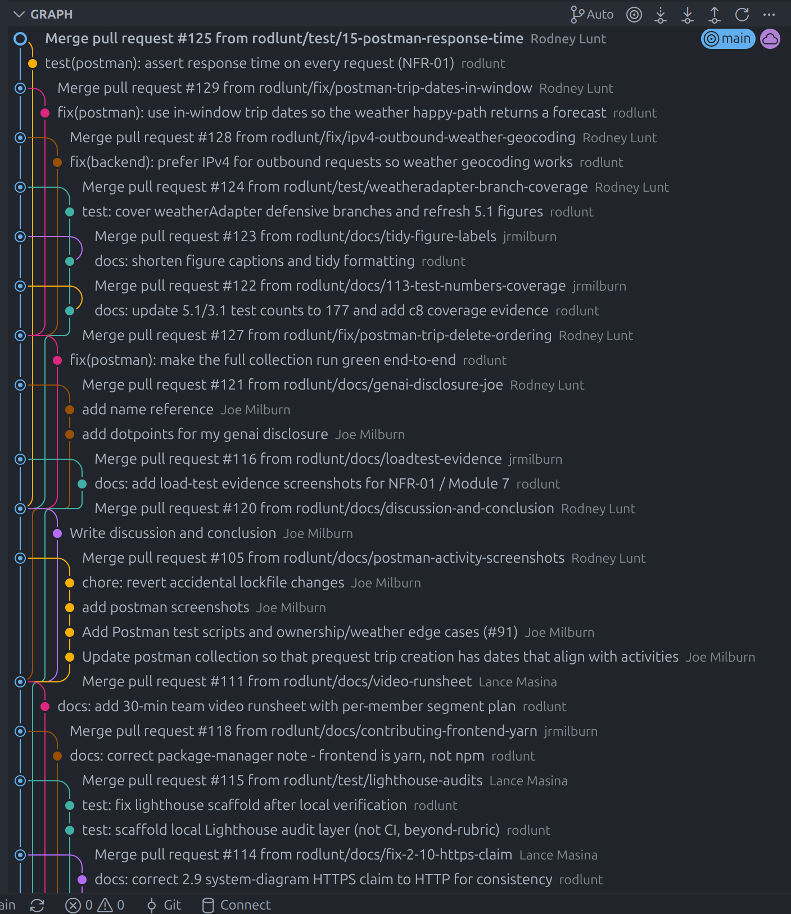

**Fig 4.2.2** - PR #66 review thread and fix PR #69

**Fig 4.2.6** - PR #74 merge conflict resolution comment

**Fig 4.2.8** - Contributor graph for all three members

Further collaboration screenshots (kanban, issues board, more PR threads) are in Appendix D.

## Functional testing (only unit testing) (~200-250 words)
*Mocha/Chai unit tests for all CRUD functions.*

### 5.1 Unit test results

The backend is tested with Mocha, Chai, and Sinon (stubbing MongoDB and external HTTP), organised by controller and middleware. Tests cover all CRUD operations for trips, activities, users, and auth, plus edge cases (Appendix E).

The Chain of Responsibility middleware (`protect`, `adminProtect`, `validate`) is tested in isolation; six tests cover the State transitions and fifteen cover the Adapter (`OpenMeteoWeatherAdapter`): geocoding, normalisation, timeout handling, and edge cases (Appendix E).

All 180 tests pass with no failures or pending cases (Figs 5.1.1-5.1.2), run in under a second, and run in CI on every push for regression coverage (Sommerville, 2016).

c8 coverage is 99.54% of statements, 99.26% of branches, and 100% of functions (Fig 5.1.3); the only gaps are the `server.js` bootstrap guard and one unreachable adapter branch.

Representative cases for the CRUD functions and each pattern are below; the full 51-case grid is in Appendix E.

| Test Case ID | Function | Expected output | Actual output | Result |
|---|---|---|---|---|
| TC-CRUD-01 | `createTrip` valid body | 201 with created trip document | 201 returned | Pass |
| TC-CRUD-02 | `getTrips` authenticated | 200 with user's trips, newest first | 200 ordered correctly | Pass |
| TC-CRUD-06 | `updateTrip` partial body | Only supplied fields updated | Partial update applied | Pass |
| TC-CRUD-07 | `deleteTrip` owned | 204; trip and activities removed | 204 returned | Pass |
| TC-CRUD-09 | `addActivity` valid | 201 with activity document | 201 returned | Pass |
| TC-CRUD-10 | `listActivitiesForTrip` | 200, sorted by date then time | 200 sorted correctly | Pass |
| TC-CRUD-04 | `getTripById` not owned | 404 (no resource enumeration) | 404 returned | Pass |
| TC-SIN-01 | `Database.getInstance()` (Singleton) | Same instance on every call | Same reference returned | Pass |
| TC-BLD-02 | `TripUpdateBuilder.build()` (Builder) | Only present fields applied; falsey values preserved | Partial update applied | Pass |
| TC-FM-01 | `UserResponseFactory.create('auth')` (Factory) | Response with id, name, email, token, isAdmin | Correct auth shape | Pass |
| TC-COR-02 | `validate([rules])` rule fails (CoR) | 400; `next()` not called; chain stops | 400; chain stopped | Pass |
| TC-FAC-03 | `UserService.deleteUserWithCascade()` (Facade) | Activities, trips, then user deleted in order | Correct cascade order | Pass |
| TC-ADP-11 | `getForecast()` vendor timeout (Adapter) | Aborts and reports timeout | Timeout error thrown | Pass |
| TC-DEC-03 | `withOwnership` not owner (Decorator) | 404; wrapped handler not called | 404; handler not called | Pass |

**Fig 5.1.1** - Test suite output (top)
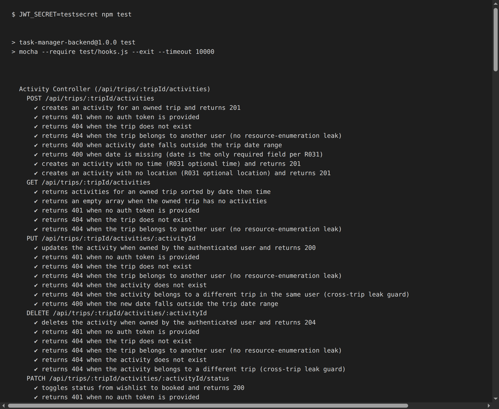

**Fig 5.1.2** - Test suite output, 180 passing (bottom)
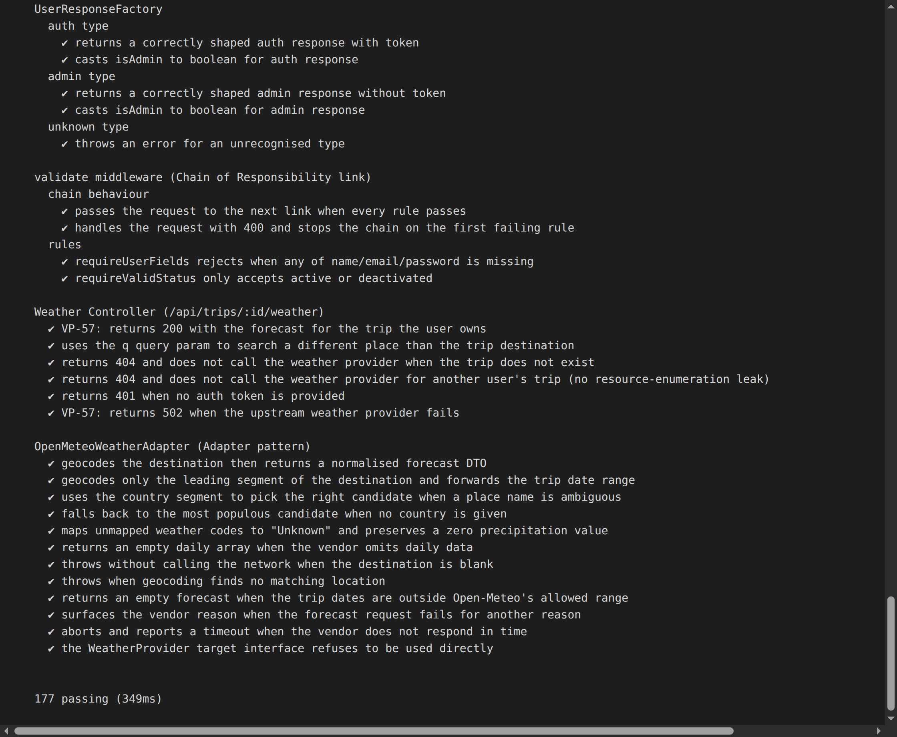

**Fig 5.1.3** - c8 coverage summary
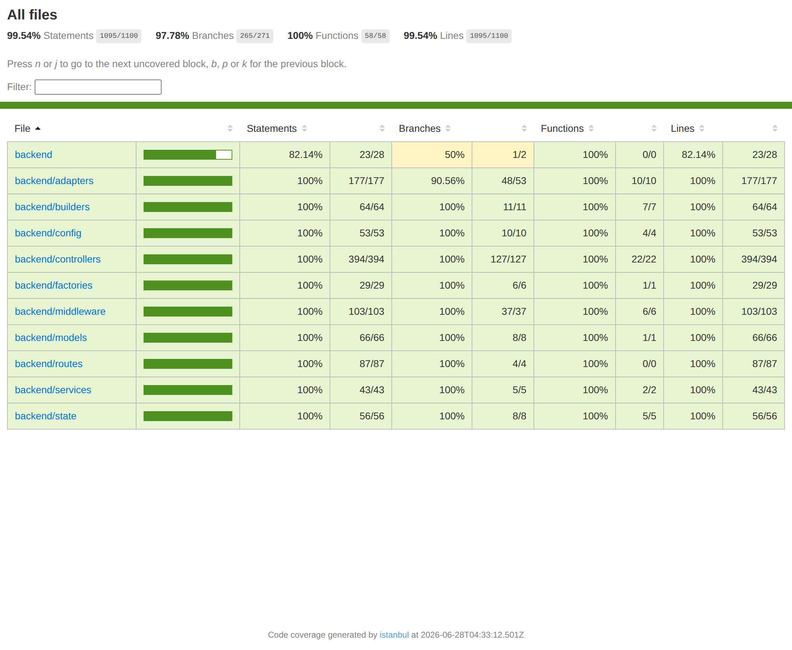

---

## API testing using Postman (~150-200 words)
*All endpoints incl. error handling; exported collection committed.*

Using Postman, we tested all REST endpoints (Fielding, 2000) across happy paths and error cases. The shared repository collection let each member run it independently; Rodney covered auth (`/api/auth/*`) and admin/CoR (`/api/admin/*`).

The admin endpoints show the Chain of Responsibility: `protect` validates the JWT (Figs 6.1.10-6.1.11) and `adminProtect` checks admin privileges (Fig 6.1.12) before the request reaches the handler.

The collection uses environment variables (`{{base_url}}`, `{{token}}`, `{{adminToken}}`) and scripts that save login tokens. A full run against the live deployment passes end to end: 41 requests, every assertion green, including the live weather forecast (Fig 6.1.0).

**Fig 6.1.0** - Full collection run against the live deployment (`http://3.26.14.122`), all assertions passing
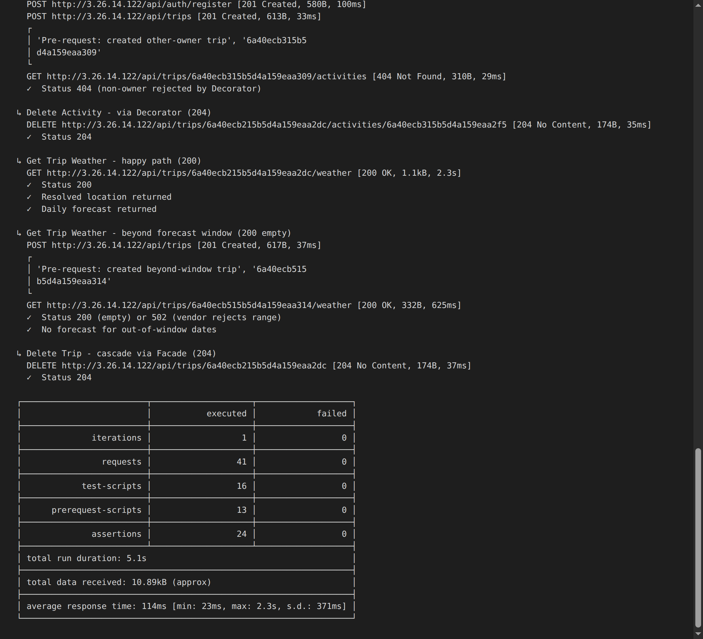

### 6.1 Request/response screenshots

Representative results are below, one per response type and pattern; the full set of 40 captures across all endpoints (happy paths and errors) is in Appendix B.

**Fig 6.1.1** - POST /api/auth/register - 201

**Fig 6.1.2** - POST /api/auth/register - 400 missing fields

**Fig 6.1.10** - GET /api/admin/users - 401 no JWT (CoR step 1)

**Fig 6.1.11** - GET /api/admin/users - 403 non-admin (CoR step 2)

**Fig 6.1.12** - POST /api/auth/login as admin - 200

**Fig 6.1.23** - GET /api/trips/:id - 404 wrong owner

**Fig 6.1.25** - PUT /api/trips/:id - 400 State planning->completed invalid

**Fig 6.1.26** - PUT /api/trips/:id - 200 State planning->active

**Fig 6.1.39** - GET /api/trips/:id/weather - happy path - 200
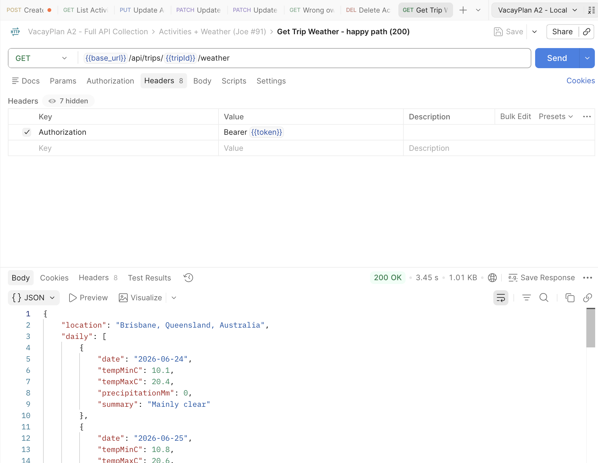

### 6.2 Exported collection

The Postman collection and environment are committed to the repository:
[`VacayPlan-A2-Collection.json`](https://github.com/rodlunt/IFQ636-assignment-2-vacayplan/blob/main/postman/VacayPlan-A2-Collection.json)
and [`VacayPlan-A2-Environment.json`](https://github.com/rodlunt/IFQ636-assignment-2-vacayplan/blob/main/postman/VacayPlan-A2-Environment.json).

---

## CI/CD pipeline setup (~150-200 words)
*GitHub Actions build/test/deploy on push; public URL; pm2 status.*

VacayPlan uses two GitHub Actions workflows. `pr-checks.yml` runs on every pull request to main: the backend test suite and a frontend production build on a GitHub-hosted runner with no deployment or secret access, restoring the PR-time test gate the original single-workflow setup lacked (Laster, 2023, Ch. 2).

`ci.yml` does continuous deployment via a self-hosted runner on an AWS EC2 t3.medium instance (Ubuntu 24.04 LTS, public IP 3.26.14.122): every merge to main triggers an automated build, test, and deploy, with no manual approval gate (Queensland University of Technology, 2026a). It covers Node 22 setup, dependency install, React build, Mocha/Chai tests, rsync deploy, nginx sync, and PM2 restart, forming the deployment pipeline (Humble & Farley, 2010). Credentials come from GitHub Actions Secrets, never the workflow file, and are never echoed to public logs (Laster, 2023, Ch. 9; GitHub Inc., 2026). It runs as Infrastructure as a Service, the team managing all configuration above the provider layer (Queensland University of Technology, 2026b). PM2 uses systemd startup to survive reboots; nginx proxies port 80 to the frontend (3000) and backend API (5001).

**Fig 7.1** - CI/CD workflow YML

**Fig 7.2** - EC2 PM2 status

**Fig 7.3** - GitHub Actions test run

**Fig 7.4** - App first page with public IP

---

## Discussion and conclusion (369 words)
*Team discussion of the development process; conclusion.*

Short-lived feature branches and pull requests let us work in parallel while keeping main deployable, every merge reviewed by another member. A post-merge review of PR #66 caught a frontend regression both test suites had missed, showing backend unit tests do not guarantee API contract safety. Merge conflicts helped too: resolving conflict #2, between Rodney's Chain of Responsibility entry and Lance's Facade branch, brought the implementation references up to date and made the documentation more accurate than either branch.

Collaboration widened the design: the weather adapter gave the Adapter pattern a home the existing code lacked, and the pipeline split into pr-checks.yml and ci.yml once a deploy-time gate proved too weak alone.

We load-tested NFR-01 on the live EC2 deployment (GET /api/trips, authenticated). At normal load (3 users) the median was 25ms with no errors, well inside the 500ms target; under stress (10 users) it held at 30ms but the 95th-percentile tail rose to 892ms (Figs 8.1-8.2). Every request succeeded and throughput held near 52 requests per second, pointing to the single EC2 node, not the code, as the limit. Being stateless with self-contained JWTs, the API scales horizontally (NFR-11): more instances can sit behind a load balancer without session affinity, and indexing trip queries on userId would cut the tail's database time (Queensland University of Technology, 2026b). The single instance meets the median target with a clear, low-risk path to higher concurrency.

**Fig 8.1** - Load test, 3 concurrent users (normal load): p50 25ms, p95 557ms, 0% errors over 520 requests

**Fig 8.2** - Load test, 10 concurrent users (stress): p50 30ms, p95 892ms, 0% errors over 572 requests
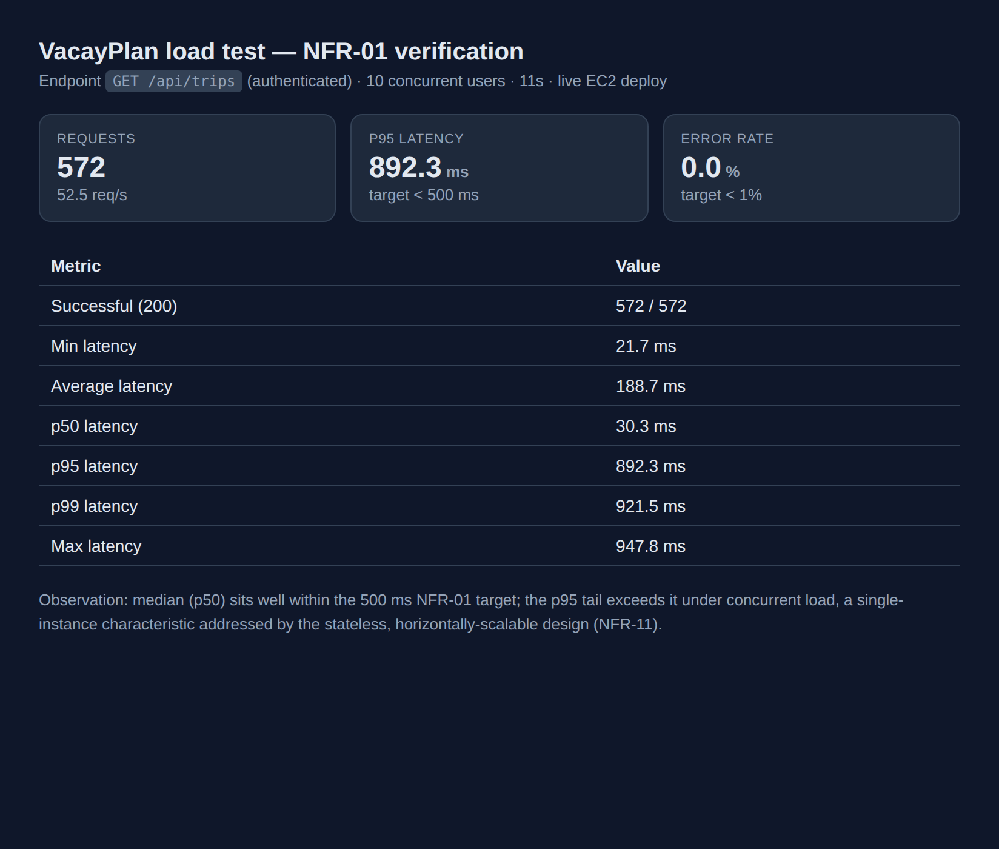

Overall, VacayPlan is a working full-stack trip-planning app built on documented design patterns and OOP principles, tested with unit and Postman checks, and deployed on every push via automated CI/CD. 

---

## 9a. Use of GenAI
*Mandatory disclosure. Source table: `planning/A2_Report_Notes.md` §9. QUT CiteWrite AI-citation format. (9a + 9b together ~150-200 words.)*

All three used Claude Code (Anthropic, 2026; Opus 4.8) as the sole AI assistant; uses overlap across the team. Logs available on request.

| Aspect | Detail |
|---|---|
| **Sample prompts** | Pattern/feature implementation; debugging; rubric and code audits; Postman authoring; SRS/diagram drafting; copyediting; Git/PR workflow. |
| **AI-assisted tasks** | Code and tests for the eight patterns; backend fixes; coverage; the Postman collection; rubric/code audits; SRS/diagram drafting; 3.1 copyedit; board scaffolding. |
| **How verified** | `npm test` between changes; code checked against the codebase; CI green; Postman/Newman re-runs. |

**Boundary:** AI drafted under student direction; design, scope and content decisions were the team's. No AI-attribution in commits or code.

*[Lance to confirm: you used Claude Code (or name your tool), and add any AI-assisted task specific to you - ~10-15 words if needed.]*

---

## 9b. Reflection
*Conversational, one genuine insight each, ~40 words per member. (9a + 9b together ~150-200 words.)*

Rodney - I assumed two green test suites meant the API was safe. PR #66 proved otherwise: a frontend regression slipped through, because unit tests show a handler behaves, not that the contract still holds. I now check contract changes across the stack, not unit tests alone.

Lance - I thought the trip status-transition checks belonged inside the TripUpdateBuilder. Building them there would have broken its single responsibility, so I moved them to a separate validation layer before the builder. Keeping each component to one job is how I work now.

*Joseph - add yours here (~25-40 words; aim ~25 to keep 9a+9b within the 200 budget), conversational like the two above: what you expected going in, what actually happened, and how it changes the way you work.*

---

## References
*APA 7th. Alphabetical, hanging indent. No invented references.*

Chacon, S., & Straub, B. (2014). *Pro Git* (2nd ed.). Apress.

Fielding, R. T. (2000). *Architectural styles and the design of network-based software architectures* [Doctoral dissertation, University of California, Irvine].
    https://ics.uci.edu/~fielding/pubs/dissertation/fielding_dissertation.pdf

Gamma, E., Helm, R., Johnson, R., & Vlissides, J. (1994). *Design patterns: Elements of reusable object-oriented software*. Addison-Wesley.

GitHub Inc. (2026). *Secure use reference*. GitHub Docs.
    https://docs.github.com/en/actions/reference/security/secure-use

Humble, J., & Farley, D. (2010). *Continuous delivery: Reliable software releases through build, test, and deployment automation*. Addison-Wesley.

Institute of Electrical and Electronics Engineers. (1998). *IEEE recommended practice for software requirements specifications* (IEEE Std 830-1998).
    https://doi.org/10.1109/IEEESTD.1998.88286

Jones, M., Bradley, J., & Sakimura, N. (2015). *JSON Web Token (JWT)* (Request for Comments No. 7519). Internet Engineering Task Force.
    https://doi.org/10.17487/RFC7519

Laster, B. (2023). *Learning GitHub actions: automation and integration of CI/CD with GitHub* (1st ed.). O'Reilly Media.

Martin, R. C. (2017). *Clean architecture: A craftsman's guide to software structure and design*. Prentice Hall.

Provos, N., & Mazières, D. (1999, June 6-11). *A future-adaptable password scheme* [Paper presentation]. 1999 USENIX Annual Technical Conference, Monterey, CA, United States.
    https://www.usenix.org/legacy/event/usenix99/provos/provos.pdf

Queensland University of Technology. (2026a). *IFQ636 Software Lifecycle Management: 1.14 DevOps and CI/CD pipelines* [Module notes]. Canvas.
    https://canvas.qutonline.edu.au/

Queensland University of Technology. (2026b). *IFQ636 Software Lifecycle Management: 7.2 Cloud infrastructure foundations* [Module notes]. Canvas.
    https://canvas.qutonline.edu.au/

Shostack, A. (2014). *Threat modeling: Designing for security*. Wiley.

Shvets, A. (2021a). *Chain of responsibility*. Refactoring.Guru.
    https://refactoring.guru/design-patterns/chain-of-responsibility

Shvets, A. (2021b). *Decorator*. Refactoring.Guru.
    https://refactoring.guru/design-patterns/decorator

Shvets, A. (2021c). *Factory method*. Refactoring.Guru.
    https://refactoring.guru/design-patterns/factory-method

Shvets, A. (2021d). *State*. Refactoring.Guru.
    https://refactoring.guru/design-patterns/state

Sommerville, I. (2016). *Software engineering* (10th ed.). Pearson.

---

## Appendix A: Branch and pull-request evidence

Every code change was developed on a dedicated feature branch (one branch per task) and merged into `main` through a reviewed pull request. Ordinary merge commits were used (never squash), so per-decision history is preserved on `main`; merged branches were then deleted, so the live branch list shows only `main`. The branch and merge topology is shown visually in the commit graph (Figure 4.2.0); the pull-request history below is the authoritative textual record.

### Headline numbers

| Metric | Value |
|---|---|
| Pull requests opened | 65 |
| Pull requests merged | 62 |
| Distinct feature branches | 63 |
| Genuine merge conflicts resolved on record | 7 |

**Commits and pull requests per member**

| Member | Commits | Pull requests |
|---|---|---|
| rodlunt (Rodney Lunt) | ~126 | 48 |
| LDMasina (Lance Masina) | ~54 | 9 |
| jrmilburn (Joseph Milburn) | ~33 | 8 |

**Branch prefixes**

| Prefix | Count |
|---|---|
| `docs/` | 34 |
| `fix/` | 10 |
| `pattern/` | 5 |
| `test/` | 5 |
| `chore/` | 4 |
| `feature/` | 3 |
| `hotfix/` | 2 |
| `feat/` | 2 |

### Pull request to branch evidence

| PR | Source branch | Author | Reviewed by | Merged | Title |
|---|---|---|---|---|---|
| #62 | `docs/vscode-issue-filters` | rodlunt | LDMasina | 2026-06-09 | Document VS Code issue filter setup |
| #63 | `chore/ignore-local-drafts` | rodlunt | - | 2026-06-10 | Ignore planning/local/ for local-only drafts |
| #64 | `pattern/builder-trip-query-update` | jrmilburn | rodlunt | 2026-06-11 | feat: Implement trip builder pattern |
| #65 | `docs/srs-requirements-2.6-2.7` | LDMasina | rodlunt | 2026-06-11 | docs: SRS sections 2.6 and 2.7 functional and non-functional requirements |
| #66 | `feature/factory-method-user-response` | LDMasina | rodlunt | 2026-06-12 | feat: Factory Method pattern - centralise user response construction |
| #68 | `docs/documentation-updates` | rodlunt | LDMasina | 2026-06-12 | docs: sync planning docs with locked pattern ownership |
| #69 | `fix/factory-admin-id-field` | LDMasina | rodlunt | 2026-06-12 | fix: restore '_id' field in admin response shape to match frontend contract |
| #70 | `pattern/singleton-db-connection` | rodlunt | jrmilburn | 2026-06-13 | feat: implement Singleton pattern for the database connection |
| #71 | `pattern/adapter` | jrmilburn | LDMasina, rodlunt | 2026-06-15 | feat: Add Open-Meteo weather forecast (Adapter pattern) |
| #72 | `docs/report-draft-updates` | rodlunt | jrmilburn | 2026-06-13 | docs: update figure placeholder, log GenAI entries, add screenshots and diagram |
| #73 | `pattern/chain-of-responsibility-middleware` | rodlunt | jrmilburn | 2026-06-13 | feat: implement Chain of Responsibility in the admin middleware pipeline |
| #74 | `docs/meeting-2-outcomes` | rodlunt | LDMasina | 2026-06-16 | docs: post meeting 2 updates - pattern ownership, role split, meeting log |
| #75 | `docs/srs-requirements-revision` | LDMasina | rodlunt | 2026-06-14 | docs: revise SRS 2.6-2.7 per Rod PR #65 feedback |
| #76 | `feature/facade-service-layer` | LDMasina | rodlunt | 2026-06-13 | feat: Facade pattern - service layer for cascade delete operations |
| #77 | `chore/update-cicd-ip-a2` | LDMasina | - | 2026-06-15 | chore: update CI/CD deploy target IP to A2 EC2 instance |
| #78 | `feature/state-trip-lifecycle` | LDMasina | rodlunt | 2026-06-15 | feat: implement State pattern for trip lifecycle (FR-10) |
| #79 | `pattern/chain-of-responsibility-middleware` | rodlunt | - | 2026-06-16 | feat: implement Decorator pattern - withOwnership handler wrapper |
| #80 | `docs/test-case-grid` | rodlunt | LDMasina | 2026-06-16 | docs: backfill unit test case grid (TC-SIN to TC-CRUD) |
| #81 | `docs/add-word-count-targets` | rodlunt | - | 2026-06-16 | docs: add per-section word count targets to document_draft headings |
| #82 | `docs/srs-2-10-2-11-draft` | rodlunt | jrmilburn | 2026-06-17 | docs: draft SRS 2.9-2.11 + diagram exports |
| #83 | `fix/trip-builder-comments` | jrmilburn | rodlunt | 2026-06-17 | Add comments to tripBuilder file |
| #84 | `docs/project-overview` | jrmilburn | rodlunt | 2026-06-17 | docs: Project overview |
| #85 | `fix/decorator-comment` | rodlunt | LDMasina | 2026-06-17 | docs: add Decorator pattern header comment to ownershipDecorator.js |
| #86 | `fix/edit-trip-status-save` | rodlunt | - | 2026-06-17 | fix: include status in EditTrip save payload |
| #87 | `docs/collaboration-evidence` | rodlunt | LDMasina | 2026-06-17 | docs: collaboration evidence screenshots and 4.2 placeholders |
| #88 | `fix/trip-hero-status-tone` | rodlunt | LDMasina | 2026-06-17 | fix: match Trip Detail status badge tone to trip state |
| #92 | `docs/readme-update` | rodlunt | LDMasina | 2026-06-17 | docs: update README - correct live URL and tidy stale references |
| #93 | `hotfix/mocha-exit-hang` | rodlunt | - | 2026-06-17 | fix: mocha --exit --timeout to unblock CI runner |
| #94 | `hotfix/jwt-secret-test-fallback` | rodlunt | - | 2026-06-17 | fix: mocha root hook JWT_SECRET fallback for local test runs |
| #95 | `docs/srs-narrative` | jrmilburn | rodlunt | 2026-06-18 | SRS narrative 2.1–2.5 (purpose, problem, scope, users, constraints) |
| #96 | `docs/cicd-evidence-7-3` | rodlunt | LDMasina | 2026-06-19 | docs: CI/CD evidence 7.3 + public IP |
| #97 | `feat/postman-auth-admin-endpoints` | rodlunt | - | 2026-06-18 | fix: return guards in protect middleware prevent double-response crash |
| #98 | `feat/postman-auth-admin-endpoints` | rodlunt | LDMasina | 2026-06-20 | docs: Postman collection + auth/admin screenshots for Section 6 |
| #99 | `fix/postman-collection-review` | rodlunt | LDMasina | 2026-06-20 | fix: Postman collection review fixes (fig numbering, admin creds, activities pre-request) |
| #100 | `docs/section-3-1-trim` | rodlunt | LDMasina | 2026-06-24 | docs: trim Section 3.1 design patterns to word target |
| #101 | `docs/section-3-2-oop` | rodlunt | LDMasina | 2026-06-20 | docs: Section 3.2 OOP write-up with inline code screenshots |
| #102 | `docs/section-4-2-collab-figures` | rodlunt | LDMasina | 2026-06-20 | docs: embed Section 4.2 collaboration figures |
| #103 | `chore/meeting-admin-20jun` | rodlunt | - | 2026-06-24 | chore: Sat 20 Jun meeting agenda + admin cleanup |
| #104 | `docs/postman-trip-screenshots-section-6` | LDMasina | rodlunt | 2026-06-24 | docs: add Section 6.1 trip CRUD and State pattern Postman figures (issue #90) |
| #105 | `docs/postman-activity-screenshots` | jrmilburn | LDMasina, rodlunt | 2026-06-28 | Postman: activity CRUD + weather test scripts (#91) |
| #106 | `chore/ci-pr-test-gate` | rodlunt | LDMasina | 2026-06-24 | ci: add PR Checks workflow to gate pull requests with tests |
| #107 | `docs/contributing-multi-pr` | rodlunt | jrmilburn | 2026-06-24 | docs: allow multiple concurrent PRs in contributing guide |
| #108 | `docs/srs-port-2-1-2-7` | rodlunt | jrmilburn | 2026-06-24 | docs: assemble SRS 2.1-2.7 into the report draft |
| #109 | `docs/fix-video-duration-30min` | rodlunt | jrmilburn | 2026-06-24 | docs: correct team video duration to 30 min (10 min per member) |
| #110 | `test/c8-coverage` | rodlunt | jrmilburn | 2026-06-24 | test: add c8 code coverage to the backend |
| #111 | `docs/video-runsheet` | rodlunt | jrmilburn, LDMasina | 2026-06-27 | docs: add 30-min team video runsheet (per-member segment plan) |
| #112 | `test/fill-coverage-gaps` | rodlunt | LDMasina | 2026-06-24 | test: cover getProfile and updateUserProfile (authController 62% -> 100%) |
| #114 | `docs/fix-2-10-https-claim` | rodlunt | LDMasina | 2026-06-24 | docs: correct 2.10 HTTPS claim to match the live HTTP deployment |
| #115 | `test/lighthouse-audits` | rodlunt | LDMasina | 2026-06-24 | test: add local Lighthouse audit layer (beyond-rubric, not CI) |
| #116 | `docs/loadtest-evidence` | rodlunt | jrmilburn | 2026-06-28 | docs: add load-test evidence screenshots (NFR-01 / Module 7) |
| #117 | `fix/pr-checks-frontend-yarn` | rodlunt | - | 2026-06-24 | fix(ci): PR Checks frontend step fails on npm ci - use yarn to match deploy |
| #118 | `docs/contributing-frontend-yarn` | rodlunt | - | 2026-06-25 | docs: correct CONTRIBUTING - frontend is yarn-managed, not npm |
| #119 | `docs/section-7-cicd-writeup` | LDMasina | - | 2026-06-24 | docs: draft Section 7 CI/CD write-up with two-workflow architecture |
| #120 | `docs/discussion-and-conclusion` | jrmilburn | rodlunt | 2026-06-28 | docs: discussion and conclusion write-up (Step 8) |
| #121 | `docs/genai-disclosure-joe` | jrmilburn | rodlunt | 2026-06-28 | docs: GenAI disclosure dot points (Joe — Adapter + Builder) |
| #122 | `docs/113-test-numbers-coverage` | rodlunt | jrmilburn | 2026-06-28 | docs: update 5.1/3.1 test numbers to 177 + coverage evidence |
| #123 | `docs/tidy-figure-labels` | rodlunt | jrmilburn | 2026-06-28 | docs: shorten figure captions + tidy formatting |
| #124 | `test/weatheradapter-branch-coverage` | rodlunt | jrmilburn | 2026-06-28 | test: cover weatherAdapter defensive branches (branches 97.78% -> 99.26%) |
| #125 | `test/15-postman-response-time` | rodlunt | - | 2026-06-28 | test(postman): response-time assertions on every request (#15) |
| #127 | `fix/postman-trip-delete-ordering` | rodlunt | - | 2026-06-28 | fix(postman): make the full collection run green end-to-end (#126) |
| #128 | `fix/ipv4-outbound-weather-geocoding` | rodlunt | - | 2026-06-28 | fix(backend): prefer IPv4 outbound so weather geocoding works |
| #129 | `fix/postman-trip-dates-in-window` | rodlunt | - | 2026-06-28 | fix(postman): in-window trip dates for a real weather forecast |
| #130 | `docs/genai-disclosure` | rodlunt | - | 2026-06-28 | docs: 9a Use of GenAI - combined team disclosure table |
| #131 | `docs/reflection` | rodlunt | - | 2026-06-28 | docs: 9b Reflection - conversational, per-member |
| #132 | `docs/postman-live-evidence` | rodlunt | - | 2026-06-28 | docs: live green-run evidence for the Postman collection (Fig 6.1.0) |

### Merge-conflict resolution records

Genuine conflicts arising from parallel work, resolved on record (commit + message):

| Commit | Resolution |
|---|---|
| `3ce58f0` | resolve conflicts with main - keep Shvets suffixes, nine unit tests, APA hanging indent |
| `ed9d9c5` | resolve conflict with main - integrate completed pattern rows into meeting-2 branch |
| `95e0963` | resolve conflicts with main - integrate State pattern and weather route |
| `9630c61` | resolve conflict with main - merge State pattern into adapter branch |
| `caf4d93` | resolve conflict with main - keep fuller meeting-2 notes |
| `4e2d810` | resolve conflicts with main - keep CoR and Facade checklist rows, add Facade and CoR references |
| `394d5e5` | resolve conflicts with main - keep Builder and Factory Method entries in all three files |

## Appendix B: API test evidence (Postman)

Complete Postman request/response evidence for every endpoint (happy paths and error cases). Representative examples appear in section 6.1.

**Fig 6.1.3** - POST /api/auth/register - 409 duplicate email

**Fig 6.1.4** - POST /api/auth/login - 200

**Fig 6.1.5** - POST /api/auth/login - 401 wrong password

**Fig 6.1.6** - POST /api/auth/login - 401 unknown user

**Fig 6.1.7** - GET /api/auth/profile - 401 no JWT (CoR protect)

**Fig 6.1.8** - GET /api/auth/profile - 200

**Fig 6.1.9** - PUT /api/auth/profile - 200 update

**Fig 6.1.13** - GET /api/admin/users - 200 all users

**Fig 6.1.14** - GET /api/admin/users/:id - 200

**Fig 6.1.15** - POST /api/admin/users - 201 create

**Fig 6.1.16** - PATCH /api/admin/users/:id - 200 deactivated

**Fig 6.1.17** - GET /api/admin/trips - 200 all trips

**Fig 6.1.18** - DELETE /api/admin/users/:id - 204

**Fig 6.1.19** - POST /api/auth/login - 200 (token acquired)

**Fig 6.1.20** - POST /api/trips - 201

**Fig 6.1.21** - GET /api/trips - 200 all trips

**Fig 6.1.22** - GET /api/trips/:id - 200

**Fig 6.1.24** - PUT /api/trips/:id - 200 update

**Fig 6.1.27** - PUT /api/trips/:id - 400 State active->planning invalid

**Fig 6.1.28** - PUT /api/trips/:id - 200 State active->completed

**Fig 6.1.29** - PUT /api/trips/:id - 400 State completed->planning invalid

**Fig 6.1.30** - DELETE /api/trips/:id - 204 cascade (Facade)

**Fig 6.1.31** - GET /api/trips - 401 no JWT

**Fig 6.1.32** - POST /api/trips/:id/activities - create - 201
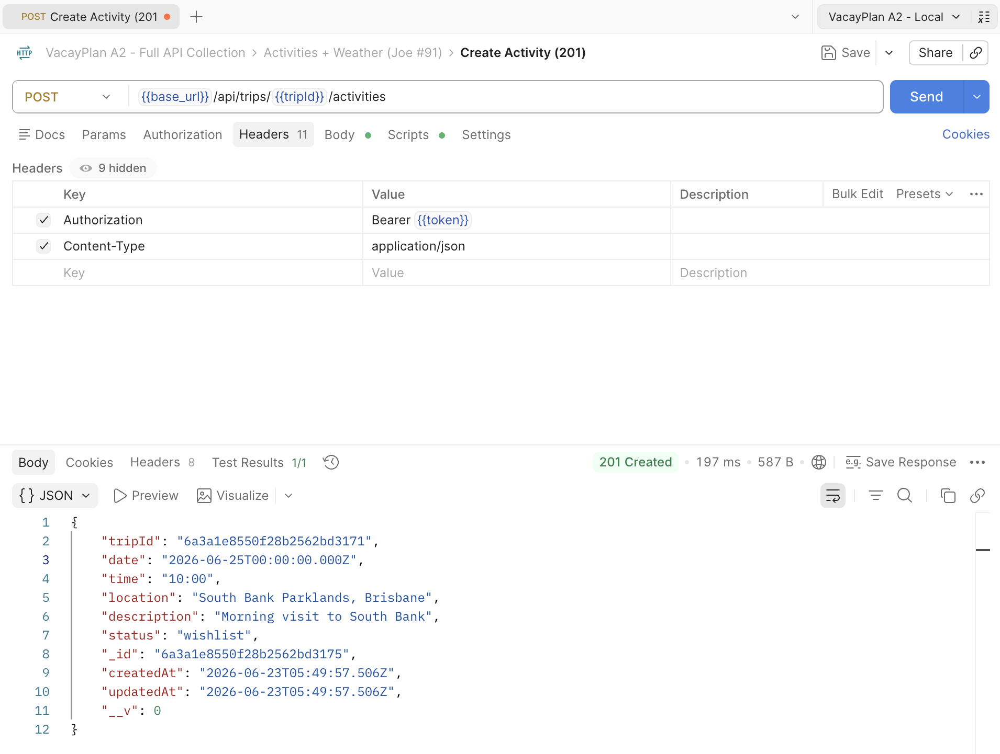

**Fig 6.1.33** - GET /api/trips/:id/activities - list - 200
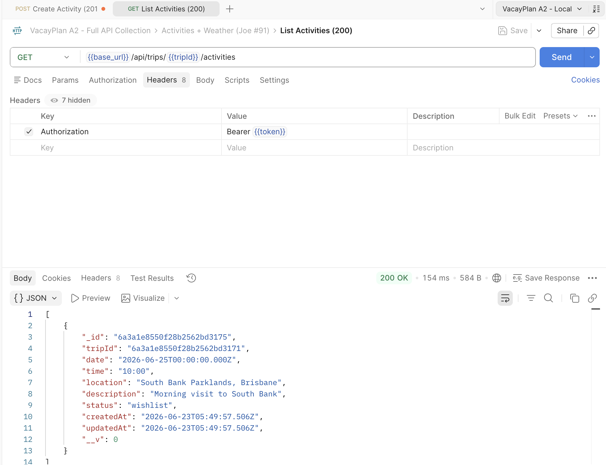

**Fig 6.1.34** - PUT /api/trips/:id/activities/:actId - update - 200
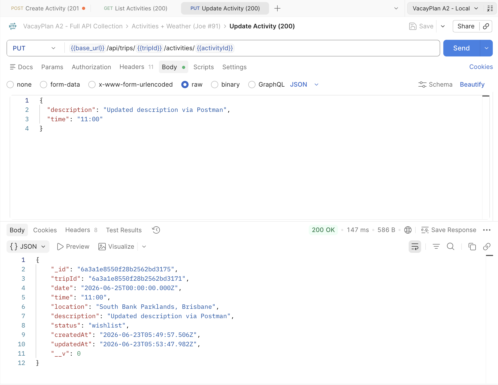

**Fig 6.1.35** - PATCH /api/trips/:id/activities/:actId/status - booked - 200
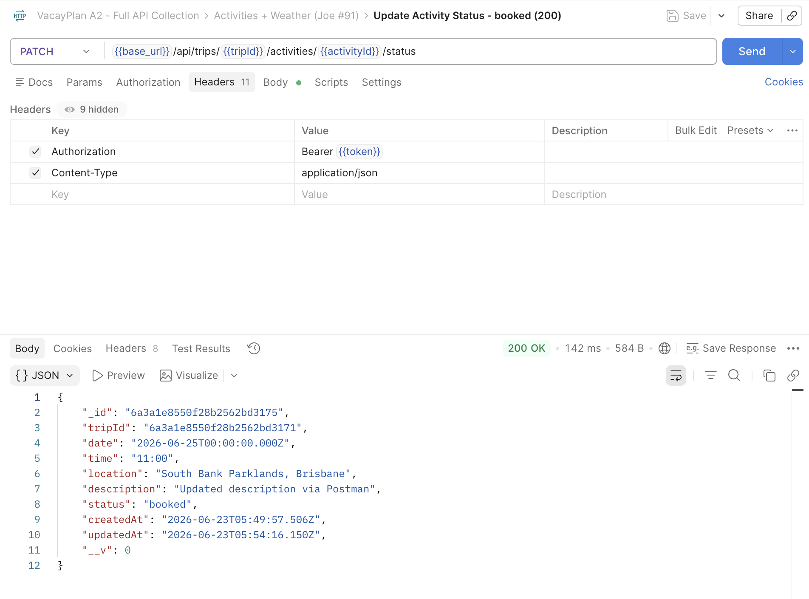

**Fig 6.1.36** - PATCH /api/trips/:id/activities/:actId/status - invalid - 400
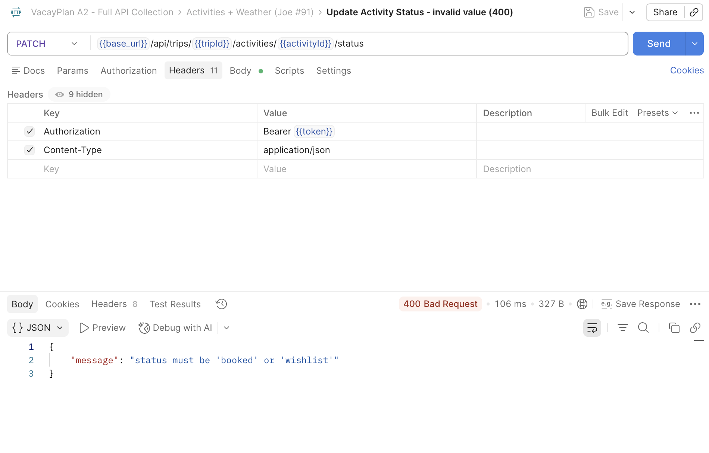

**Fig 6.1.37** - GET /api/trips/:id/activities - wrong owner - 404
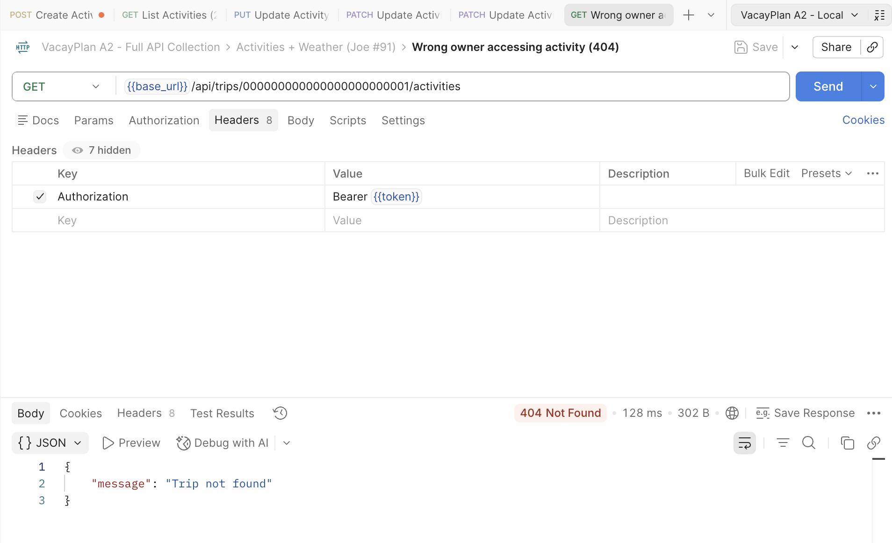

**Fig 6.1.38** - DELETE /api/trips/:id/activities/:actId - 204
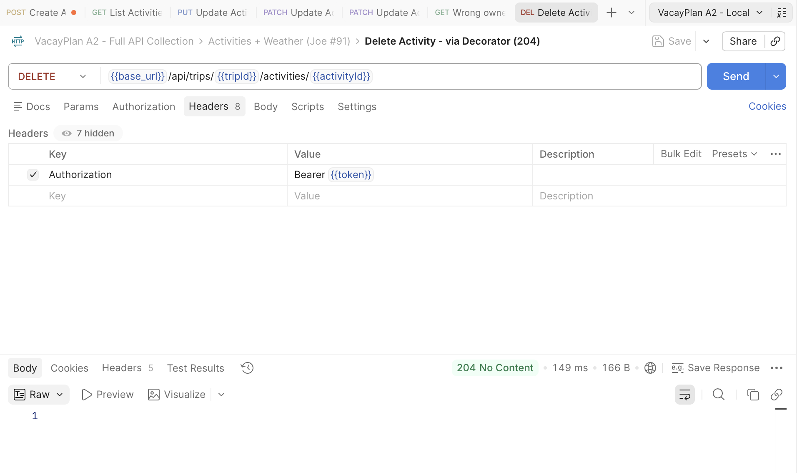

**Fig 6.1.40** - GET /api/trips/:id/weather - beyond forecast window - 200
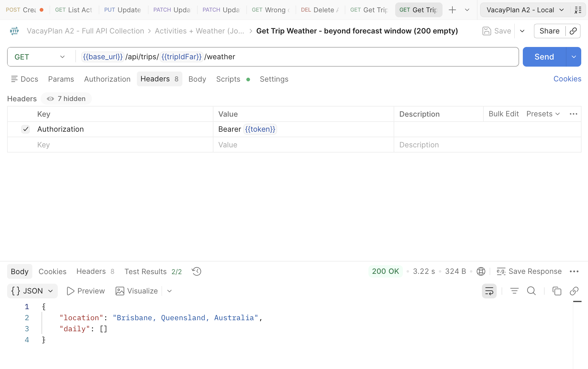

## Appendix C: Complete requirement tables

Full functional and non-functional requirement tables for the SRS (sections 2.6 and 2.7); summaries appear in the body.

### Functional requirements

**Authentication**

| ID | Requirement |
|---|---|
| FR-01 | The system shall allow a user to register an account using a unique email address and password. |
| FR-02 | The system shall authenticate a registered user via email and password and issue a JSON Web Token (JWT) upon successful login. |
| FR-03 | The system shall restrict access to all protected routes to authenticated users only. |
| FR-04 | The system shall allow a user to log out, invalidating their active session token. |

**Trip management**

| ID | Requirement |
|---|---|
| FR-05 | The system shall allow a regular user to create a trip record with a destination, date range, budget, and status. |
| FR-06 | The system shall allow a regular user to view all trips associated with their account on a dashboard. |
| FR-07 | The system shall allow a regular user to update the details of an existing trip. |
| FR-08 | The system shall allow a regular user to delete a trip record from their account. |
| FR-09 | The system shall assign one of three statuses to each trip: planning, active, or completed. |
| FR-10 | The system shall enforce that trip status transitions follow the defined lifecycle: planning to active to completed. |
| FR-11 | The system shall remove all activities associated with a trip when that trip is permanently deleted. |

**Activity management**

| ID | Requirement |
|---|---|
| FR-12 | The system shall allow a regular user to add an activity to an existing trip, specifying a name, date, and description. |
| FR-13 | The system shall restrict activity dates to fall within the parent trip date range. |
| FR-14 | The system shall allow a regular user to view all activities associated with a trip, organised by day. |
| FR-15 | The system shall allow a regular user to update or delete an activity they have created. |

**Administration**

| ID | Requirement |
|---|---|
| FR-16 | The system shall provide an administrator with a user management panel listing all registered accounts. |
| FR-17 | The system shall allow an administrator to deactivate or reactivate a user account. |
| FR-18 | The system shall allow an administrator to permanently delete a user account. |
| FR-19 | The system shall remove all trips and activities associated with a user account when that account is permanently deleted. |
| FR-20 | The system shall allow an administrator to view all trips across all user accounts. |
| FR-21 | The system shall prevent a deactivated user from accessing protected routes until their account is reactivated. |
| FR-22 | The system shall return all API responses in a consistent JSON structure, with a standardised shape for user objects regardless of the operation type. |
| FR-23 | The system shall validate all incoming API requests before they reach business logic handlers. |

### Non-functional requirements

**Performance**

| ID | Requirement |
|---|---|
| NFR-01 | The system shall return API responses for standard CRUD operations within 500 milliseconds under normal load conditions. |
| NFR-02 | The frontend dashboard shall render the full trip list within two seconds of a successful authentication event. |

**Reliability**

| ID | Requirement |
|---|---|
| NFR-03 | The system shall maintain a minimum uptime of 99% during the operational period, supported by PM2 process management on the EC2 deployment. |
| NFR-04 | The CI/CD pipeline shall automatically redeploy the application on every push to the main branch, ensuring the live environment reflects the latest stable build. |

**Security**

| ID | Requirement |
|---|---|
| NFR-05 | The system shall encrypt all user passwords using bcrypt before storage in the database. |
| NFR-06 | The system shall use JWT tokens with a defined expiry period to manage authenticated sessions, rejecting expired or malformed tokens. |
| NFR-07 | The system shall restrict all administrative operations to users with a verified administrator role, enforced at the middleware layer. |
| NFR-08 | The system shall not expose database credentials or JWT secrets in any client-accessible code or version control history. |
| NFR-13 | The system shall initialise a single shared database connection instance at application startup, reusing it across all subsequent operations for the lifetime of the process. |

**Usability**

| ID | Requirement |
|---|---|
| NFR-09 | The system shall provide a responsive user interface accessible on desktop and mobile browsers without requiring a native application installation. |
| NFR-10 | The system shall display meaningful error messages to the user when an operation fails, without exposing internal system details. |

**Scalability**

| ID | Requirement |
|---|---|
| NFR-11 | The system architecture shall support horizontal scaling by maintaining stateless API design, enabling additional backend instances to be added without session conflicts. |
| NFR-12 | The MongoDB Atlas database layer shall support collection growth without requiring schema migration, accommodating an increasing number of users and trips over time. |

**Availability**

| ID | Requirement |
|---|---|
| NFR-14 | Core trip planning features shall remain available when external data services are unavailable. |

## Appendix D: Additional collaboration screenshots

Supplementary evidence supporting section 4.2.

**Fig 4.2.1** - Kanban board (13 Jun) with Blocked column in use

**Fig 4.2.3** - PR #66 fix closing the flagged issue

**Fig 4.2.4** - Issues board with assignees across the team

**Fig 4.2.5** - PR #71 multi-turn review thread

**Fig 4.2.7** - PR #81 word-count coordination comment

## Appendix E: Complete test-case grid

All 51 unit test cases (representative subset in section 5.1). Test Case ID, function, expected output, actual output, result.

| Test Case ID | Function | Expected Output | Actual Output | Pass/Fail |
|--------------|----------|-----------------|---------------|-----------|
| TC-SIN-01 | `Database.getInstance()` | Same instance returned on every call | Same object reference returned | Pass |
| TC-SIN-02 | `new Database()` after instance exists | Throws on direct construction | Error thrown | Pass |
| TC-SIN-03 | `db.connect()` called twice | `mongoose.connect` called exactly once | One connection opened | Pass |
| TC-SIN-04 | `db.connect()` after established | Returns same connection promise | Existing promise reused | Pass |
| TC-BLD-01 | `TripQueryBuilder.build()` | Filter `{ userId }` and sort `{ createdAt: -1 }` | Correct filter and sort | Pass |
| TC-BLD-02 | `TripUpdateBuilder.build()` | Only present fields applied; falsey values (0, '') preserved | Partial update applied correctly | Pass |
| TC-FM-01 | `UserResponseFactory.create('auth')` | Response with `id`, `name`, `email`, `token`, `isAdmin` (boolean) | Correct auth shape returned | Pass |
| TC-FM-02 | `UserResponseFactory.create('auth')` isAdmin cast | `isAdmin` is strict boolean regardless of source type | Boolean cast applied | Pass |
| TC-FM-03 | `UserResponseFactory.create('admin')` | Response with `_id`, `name`, `email`, `isAdmin`; no `token` | Correct admin shape returned | Pass |
| TC-FM-04 | `UserResponseFactory.create('admin')` isAdmin cast | `isAdmin` is strict boolean | Boolean cast applied | Pass |
| TC-FM-05 | `UserResponseFactory.create('unknown')` | Throws for unrecognised type | Error thrown | Pass |
| TC-COR-01 | `validate([rules])` - all rules pass | `next()` called once; no error response sent | next() called; no status/json | Pass |
| TC-COR-02 | `validate([rules])` - rule fails | 400 returned; `next()` not called; chain stops | 400 JSON; chain stopped | Pass |
| TC-COR-03 | `requireUserFields` | Returns null when all fields present; error string when any missing | Correct per-field validation | Pass |
| TC-COR-04 | `requireValidStatus` | Returns null for `active`/`deactivated`; error string otherwise | Correct status validation | Pass |
| TC-FAC-01 | `TripService.deleteTripWithActivities()` | `Activity.deleteMany` and `trip.deleteOne` both called | Both called | Pass |
| TC-FAC-02 | `TripService.deleteTripWithActivities()` ordering | `Activity.deleteMany` called before `trip.deleteOne` | Correct deletion order | Pass |
| TC-FAC-03 | `UserService.deleteUserWithCascade()` | Activities, trips, then user deleted in sequence | Correct cascade order | Pass |
| TC-FAC-04 | `UserService.deleteUserWithCascade()` audit | `[AUDIT]` log written with user and admin identity | Audit log written | Pass |
| TC-ADP-01 | `OpenMeteoWeatherAdapter.getForecast()` nominal | Normalised forecast DTO with geocoded destination and daily data | Correct DTO returned | Pass |
| TC-ADP-02 | `getForecast()` destination parsing | Uses leading segment of "City, Country" for geocoding | Leading segment used | Pass |
| TC-ADP-03 | `getForecast()` country disambiguation | Country segment used to select correct geocoding candidate | Correct candidate selected | Pass |
| TC-ADP-04 | `getForecast()` no country given | Falls back to most populous geocoding candidate | Most populous selected | Pass |
| TC-ADP-05 | `getForecast()` unmapped WMO code | Maps unknown codes to "Unknown"; preserves zero precipitation | Unknown mapped; 0 preserved | Pass |
| TC-ADP-06 | `getForecast()` vendor omits daily data | Returns empty daily array | Empty array returned | Pass |
| TC-ADP-07 | `getForecast()` blank destination | Throws without making network call | Error thrown pre-network | Pass |
| TC-ADP-08 | `getForecast()` no location found | Throws when geocoding returns no match | Error thrown | Pass |
| TC-ADP-09 | `getForecast()` dates outside forecast window | Returns empty forecast | Empty forecast returned | Pass |
| TC-ADP-10 | `getForecast()` forecast request fails | Surfaces vendor error reason | Vendor error surfaced | Pass |
| TC-ADP-11 | `getForecast()` vendor timeout | Aborts and reports timeout | Timeout error thrown | Pass |
| TC-ADP-12 | `WeatherProvider` base class | Refuses direct use; error thrown on direct instantiation | Error thrown | Pass |
| TC-ADP-13 | `GET /api/trips/:id/weather` owned trip | 200 with forecast DTO | 200 with forecast | Pass |
| TC-ADP-14 | `GET /api/trips/:id/weather?q=place` | Uses `q` param as destination instead of trip destination | Override destination used | Pass |
| TC-ADP-15 | `GET /api/trips/:id/weather` trip not found | 404; provider not called | 404 returned | Pass |
| TC-ADP-16 | `GET /api/trips/:id/weather` another user's trip | 404 (no resource enumeration) | 404 returned | Pass |
| TC-ADP-17 | `GET /api/trips/:id/weather` no auth | 401 | 401 returned | Pass |
| TC-ADP-18 | `GET /api/trips/:id/weather` provider fails | 502 | 502 returned | Pass |
| TC-DEC-01 | `withOwnership` - user owns trip | Attaches trip to `req.trip`; calls wrapped handler | req.trip set; handler called once | Pass |
| TC-DEC-02 | `withOwnership` - trip not found | 404 `{ message: 'Trip not found' }`; handler not called | 404 returned; handler not called | Pass |
| TC-DEC-03 | `withOwnership` - user does not own trip | 404 `{ message: 'Trip not found' }`; handler not called | 404 returned; handler not called | Pass |
| TC-DEC-04 | `withOwnership` - activity route (`req.params.tripId`) | Resolves trip via `tripId` param; attaches to `req.trip`; calls handler | req.trip set; handler called once | Pass |
| TC-CRUD-01 | `createTrip` valid body | 201 with created trip document | 201 returned | Pass |
| TC-CRUD-02 | `getTrips` authenticated | 200 with user's trips ordered newest first | 200 ordered correctly | Pass |
| TC-CRUD-03 | `getTripById` owned | 200 with matching trip | 200 returned | Pass |
| TC-CRUD-04 | `getTripById` not owned | 404 (no resource enumeration) | 404 returned | Pass |
| TC-CRUD-05 | `updateTrip` owned | 200 with updated trip | 200 returned | Pass |
| TC-CRUD-06 | `updateTrip` partial body | Only supplied fields updated; omitted fields unchanged | Partial update applied | Pass |
| TC-CRUD-07 | `deleteTrip` owned | 204 No Content; trip and activities removed | 204 returned | Pass |
| TC-CRUD-08 | `deleteTrip` cascade ordering | Activities deleted before trip document | Correct cascade order | Pass |
| TC-CRUD-09 | `addActivity` valid | 201 with activity document | 201 returned | Pass |
| TC-CRUD-10 | `listActivitiesForTrip` | 200 with activities sorted by date then time | 200 sorted correctly | Pass |
